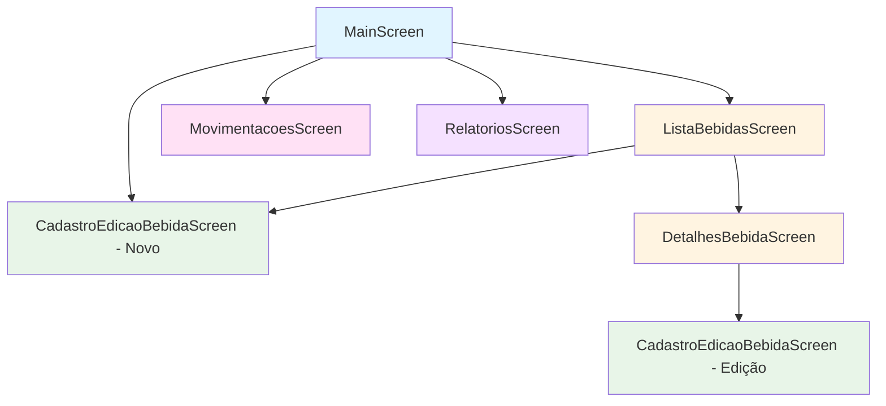

# Diagramas do Projeto - Distribuidora do Zeh

## 1. Diagrama de Navegação



### Descrição das Navegações

1. **MainScreen → ListaBebidasScreen**: Visualizar todas as bebidas
2. **MainScreen → CadastroEdicaoBebidaScreen**: Cadastrar nova bebida
3. **MainScreen → MovimentacoesScreen**: Registrar movimentações
4. **MainScreen → RelatoriosScreen**: Ver relatórios e estatísticas
5. **ListaBebidasScreen → DetalhesBebidaScreen**: Ver detalhes de uma bebida
6. **ListaBebidasScreen → CadastroEdicaoBebidaScreen**: Adicionar nova bebida
7. **DetalhesBebidaScreen → CadastroEdicaoBebidaScreen**: Editar bebida existente

---

## 2. Diagrama Entidade-Relacionamento (ER)

```
╔═══════════════╗
║   CATEGORIA   ║
╠═══════════════╣
║ PK id         ║
║    nome       ║
╚═══════════════╝
        │
        │ 1
        │
        │ (categoriaId)
        │
        │ N
        ▼
╔═══════════════════════╗
║       BEBIDA          ║
╠═══════════════════════╣
║ PK id                 ║
║ FK categoriaId        ║
║    nome               ║
║    volume             ║
║    quantidadeEstoque  ║
║    precoCompra        ║
║    precoVenda         ║
╚═══════════════════════╝
        │
        │ 1
        │
        │ (bebidaId)
        │
        │ N
        ▼
╔═══════════════════════╗
║    MOVIMENTACAO       ║
╠═══════════════════════╣
║ PK id                 ║
║ FK bebidaId           ║
║    tipo               ║
║    quantidade         ║
║    data               ║
║    observacao         ║
╚═══════════════════════╝
```

### Relacionamentos

- **CATEGORIA → BEBIDA**: Um para Muitos (1:N)

  - Uma categoria pode ter várias bebidas
  - Cada bebida pertence a uma categoria
  - CASCADE DELETE: Ao excluir categoria, exclui bebidas

- **BEBIDA → MOVIMENTACAO**: Um para Muitos (1:N)
  - Uma bebida pode ter várias movimentações
  - Cada movimentação pertence a uma bebida
  - CASCADE DELETE: Ao excluir bebida, exclui movimentações

---

## 3. Diagrama de Arquitetura MVVM

```
┌─────────────────────────────────────────────────────────┐
│                         VIEW                            │
│                   (Jetpack Compose)                     │
│  ┌──────────┐  ┌──────────┐  ┌──────────┐             │
│  │  Main    │  │  Lista   │  │ Detalhes │  ...        │
│  │  Screen  │  │  Bebidas │  │  Bebida  │             │
│  └──────────┘  └──────────┘  └──────────┘             │
└──────────────────────┬──────────────────────────────────┘
                       │ observa StateFlow
                       │
┌──────────────────────▼──────────────────────────────────┐
│                    VIEWMODEL                            │
│         (Gerencia Estado e Lógica de UI)                │
│  ┌────────────┐  ┌────────────┐  ┌────────────┐       │
│  │  Bebida    │  │Movimentacao│  │ Relatorio  │       │
│  │ ViewModel  │  │ ViewModel  │  │ ViewModel  │       │
│  └────────────┘  └────────────┘  └────────────┘       │
└──────────────────────┬──────────────────────────────────┘
                       │ chama métodos
                       │
┌──────────────────────▼──────────────────────────────────┐
│                   REPOSITORY                            │
│         (Abstração de Fonte de Dados)                   │
│              DistribuidoraRepository                    │
└──────────────────────┬──────────────────────────────────┘
                       │ usa DAOs
                       │
┌──────────────────────▼──────────────────────────────────┐
│                      MODEL                              │
│             (Dados e Lógica de Negócio)                 │
│  ┌────────────────────────────────────────────┐         │
│  │            ROOM DATABASE                    │         │
│  │  ┌──────────┐  ┌──────────┐  ┌──────────┐ │         │
│  │  │Categoria │  │  Bebida  │  │Moviment. │ │         │
│  │  │   DAO    │  │   DAO    │  │   DAO    │ │         │
│  │  └──────────┘  └──────────┘  └──────────┘ │         │
│  │                                             │         │
│  │  ┌──────────┐  ┌──────────┐  ┌──────────┐ │         │
│  │  │Categoria │  │  Bebida  │  │Moviment. │ │         │
│  │  │  Entity  │  │  Entity  │  │  Entity  │ │         │
│  │  └──────────┘  └──────────┘  └──────────┘ │         │
│  └────────────────────────────────────────────┘         │
│                                                          │
│  ┌────────────────────────────────────────────┐         │
│  │         SQLite Database (Local)             │         │
│  └────────────────────────────────────────────┘         │
└──────────────────────────────────────────────────────────┘
```

---

## 4. Fluxo de Dados

### Exemplo: Cadastrar uma Bebida

```
┌──────────┐       ┌──────────┐       ┌──────────┐       ┌──────────┐
│   View   │       │ViewModel │       │Repository│       │   DAO    │
└────┬─────┘       └────┬─────┘       └────┬─────┘       └────┬─────┘
     │                  │                   │                   │
     │ insertBebida()   │                   │                   │
     ├─────────────────>│                   │                   │
     │                  │                   │                   │
     │                  │ insertBebida()    │                   │
     │                  ├──────────────────>│                   │
     │                  │                   │                   │
     │                  │                   │ insert(bebida)    │
     │                  │                   ├──────────────────>│
     │                  │                   │                   │
     │                  │                   │    Salva no DB    │
     │                  │                   │<──────────────────┤
     │                  │                   │                   │
     │                  │    Flow atualiza  │                   │
     │                  │<──────────────────┤                   │
     │                  │                   │                   │
     │  StateFlow emit  │                   │                   │
     │<─────────────────┤                   │                   │
     │                  │                   │                   │
     │  UI Recompõe     │                   │                   │
     │                  │                   │                   │
```

### Exemplo: Registrar Saída de Estoque

```
┌──────────┐       ┌────────────┐       ┌──────────┐       ┌──────────┐
│   View   │       │  ViewModel │       │Repository│       │   DAO    │
└────┬─────┘       └─────┬──────┘       └────┬─────┘       └────┬─────┘
     │                   │                    │                   │
     │ registrarSaida()  │                    │                   │
     ├──────────────────>│                    │                   │
     │                   │                    │                   │
     │                   │ registrarSaida()   │                   │
     │                   ├───────────────────>│                   │
     │                   │                    │                   │
     │                   │                    │ getBebidaById()   │
     │                   │                    ├──────────────────>│
     │                   │                    │                   │
     │                   │                    │ Valida estoque    │
     │                   │                    │<──────────────────┤
     │                   │                    │                   │
     │                   │                    │ removerEstoque()  │
     │                   │                    ├──────────────────>│
     │                   │                    │                   │
     │                   │                    │ insertMoviment.() │
     │                   │                    ├──────────────────>│
     │                   │                    │                   │
     │                   │  successMessage    │                   │
     │                   │<───────────────────┤                   │
     │                   │                    │                   │
     │  Mostra diálogo   │                    │                   │
     │<──────────────────┤                    │                   │
     │                   │                    │                   │
```

---

## 5. Estrutura de Pacotes

```
com.example.distribuidora_do_zeh
│
├── 📁 data
│   ├── 📁 entity
│   │   ├── 📄 Categoria.kt
│   │   ├── 📄 Bebida.kt
│   │   ├── 📄 Movimentacao.kt
│   │   ├── 📄 BebidaComCategoria.kt
│   │   └── 📄 BebidaComMovimentacoes.kt
│   │
│   ├── 📁 dao
│   │   ├── 📄 CategoriaDao.kt
│   │   ├── 📄 BebidaDao.kt
│   │   └── 📄 MovimentacaoDao.kt
│   │
│   ├── 📁 database
│   │   └── 📄 AppDatabase.kt
│   │
│   └── 📁 repository
│       └── 📄 DistribuidoraRepository.kt
│
├── 📁 viewmodel
│   ├── 📄 BebidaViewModel.kt
│   ├── 📄 MovimentacaoViewModel.kt
│   └── 📄 RelatorioViewModel.kt
│
├── 📁 ui
│   ├── 📁 screens
│   │   ├── 📄 MainScreen.kt
│   │   ├── 📄 ListaBebidasScreen.kt
│   │   ├── 📄 DetalhesBebidaScreen.kt
│   │   ├── 📄 CadastroEdicaoBebidaScreen.kt
│   │   ├── 📄 MovimentacoesScreen.kt
│   │   └── 📄 RelatoriosScreen.kt
│   │
│   └── 📁 theme
│       ├── 📄 Color.kt
│       ├── 📄 Theme.kt
│       └── 📄 Type.kt
│
├── 📁 navigation
│   ├── 📄 Screen.kt
│   └── 📄 AppNavigation.kt
│
└── 📄 MainActivity.kt
```

---

## 6. Casos de Uso Principais

### UC01: Cadastrar Bebida

```
Ator: Usuário
Pré-condição: Aplicativo aberto
Fluxo Principal:
1. Usuário navega para "Cadastrar Bebida"
2. Sistema exibe formulário
3. Usuário preenche: nome, categoria, volume, estoque, preços
4. Usuário clica em "Cadastrar"
5. Sistema valida dados
6. Sistema salva no banco de dados
7. Sistema retorna à tela anterior
Pós-condição: Bebida cadastrada e visível na lista
```

### UC02: Registrar Entrada de Estoque

```
Ator: Usuário
Pré-condição: Bebidas cadastradas
Fluxo Principal:
1. Usuário navega para "Movimentações"
2. Sistema exibe formulário
3. Usuário seleciona bebida
4. Usuário seleciona tipo "Entrada"
5. Usuário informa quantidade
6. Usuário adiciona observação (opcional)
7. Sistema mostra preview do novo estoque
8. Usuário confirma registro
9. Sistema atualiza estoque
10. Sistema registra movimentação
11. Sistema exibe mensagem de sucesso
Pós-condição: Estoque atualizado e movimentação registrada
```

### UC03: Visualizar Relatórios

```
Ator: Usuário
Pré-condição: Dados de bebidas e movimentações existem
Fluxo Principal:
1. Usuário navega para "Relatórios"
2. Sistema calcula estatísticas:
   - Total de itens
   - Total de unidades
   - Valor de compra total
   - Valor de venda total
   - Lucro potencial
3. Sistema identifica produtos com estoque baixo
4. Sistema exibe relatório formatado
Pós-condição: Relatório visualizado
```

---

## 7. Modelo de Dados - Exemplo de Registros

### Tabela: categorias

| id  | nome         |
| --- | ------------ |
| 1   | Cerveja      |
| 2   | Refrigerante |
| 3   | Suco         |
| 4   | Água         |
| 5   | Energético   |

### Tabela: bebidas

| id  | categoriaId | nome               | volume | quantidadeEstoque | precoCompra | precoVenda |
| --- | ----------- | ------------------ | ------ | ----------------- | ----------- | ---------- |
| 1   | 1           | Skol Pilsen        | 350ml  | 50                | 2.50        | 4.00       |
| 2   | 1           | Brahma Duplo Malte | 350ml  | 30                | 3.00        | 4.50       |
| 3   | 2           | Coca-Cola          | 2L     | 40                | 5.00        | 8.00       |
| 4   | 2           | Guaraná Antarctica | 2L     | 35                | 4.50        | 7.50       |
| 5   | 4           | Água Crystal       | 500ml  | 100               | 1.00        | 2.00       |

### Tabela: movimentacoes

| id  | bebidaId | tipo    | quantidade | data                | observacao         |
| --- | -------- | ------- | ---------- | ------------------- | ------------------ |
| 1   | 1        | Entrada | 50         | 2025-01-15 10:30:00 | Compra inicial     |
| 2   | 1        | Saída   | 12         | 2025-01-16 14:20:00 | Venda para bar     |
| 3   | 3        | Entrada | 30         | 2025-01-17 09:15:00 | Reposição estoque  |
| 4   | 3        | Saída   | 5          | 2025-01-17 16:45:00 | Cliente João Silva |

---

**Nota**: Os diagramas em formato Mermaid podem ser visualizados em plataformas que suportam Markdown com Mermaid, como GitHub, GitLab, ou editores como Obsidian e Typora.
